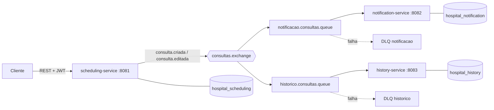

# Tech Challenge - Fase 03

Backend modular desenvolvido com Java e Spring Boot para agendamento de consultas, gestão do histórico de pacientes e envio automático de lembretes em um ambiente hospitalar, com foco em segurança e comunicação assíncrona entre serviços.

---

# Contexto do Projeto

Em um ambiente hospitalar é essencial contar com sistemas que garantam o agendamento eficaz de consultas, o gerenciamento do histórico de pacientes e o envio de lembretes automáticos para assegurar a presença dos pacientes nas consultas.

O sistema deve ser acessível a diferentes perfis de usuário — médicos, enfermeiros e pacientes — com acesso controlado e funcionalidades específicas para cada um.

Nesta terceira fase, o projeto evoluiu de uma aplicação única para uma arquitetura distribuída em múltiplos serviços independentes, que se comunicam de forma assíncrona por mensageria, sem que nenhum serviço acesse o banco de dados do outro.

---

# Tecnologias

- Java 21
- Spring Boot 3.5.16
- Spring Web
- Spring Data JPA
- Spring Security
- JWT (jjwt 0.12.6)
- Spring for GraphQL
- Spring AMQP
- RabbitMQ
- PostgreSQL
- Flyway
- Docker & Docker Compose
- Spring Validation
- SpringDoc OpenAPI
- Maven (projeto multi-módulo)
- H2 Database (testes)
- JaCoCo

---

# Arquitetura

O projeto é um **reactor Maven multi-módulo** composto por três serviços independentes e dois módulos compartilhados. Cada serviço tem seu próprio banco de dados e ciclo de vida, e a integração entre eles acontece exclusivamente por eventos publicados no RabbitMQ.

```
common
 ├── common-events        contrato dos eventos e topologia do broker
 └── common-security      emissão e validação de JWT

scheduling-service        porta 8081
 ├── auth                 login e emissão do token
 ├── config               security, rabbitmq, openapi
 ├── consulta             domínio de consultas
 ├── exception            tratamento global de erros
 ├── messaging            publicação dos eventos
 └── usuario              usuários e perfis de acesso

notification-service      porta 8082
 ├── config
 ├── messaging            consumo dos eventos
 └── notificacao          geração dos lembretes

history-service           porta 8083
 ├── config
 ├── graphql              resolvers e schema
 ├── historico            modelo de leitura do histórico
 └── messaging            consumo dos eventos
```

### Fluxo entre os serviços



### Princípios aplicados

- SOLID
- Clean Code
- Separation of Concerns
- Organização por domínio (package by feature)
- Serviços autônomos, sem acesso cruzado a banco de dados

---

# Tipos de Usuário

- Médico
- Enfermeiro
- Paciente

---

# Funcionalidades

## Agendamento (scheduling-service)

- Autenticação e emissão de token JWT
- Registro de novas consultas
- Edição de consultas existentes
- Consulta por id
- Listagem de consultas, com filtro por paciente
- Publicação de evento a cada consulta criada ou editada

## Notificações (notification-service)

- Consumo assíncrono dos eventos de consulta
- Geração automática de lembrete ao paciente
- Listagem dos lembretes enviados
- Idempotência por identificador de evento, evitando lembretes duplicados

## Histórico (history-service)

- Consumo assíncrono dos eventos de consulta
- Reconstrução do histórico a partir dos eventos recebidos
- Consultas flexíveis via GraphQL
- Descarte de eventos duplicados ou fora de ordem

## Segurança

- Autenticação JWT stateless
- Token emitido pelo agendamento e aceito pelos três serviços
- Endpoints protegidos por perfil de acesso
- Restrição de acesso ao dado do próprio paciente

---

# Níveis de Acesso

| Perfil | Permissões |
|---|---|
| Médico | Registrar e editar consultas, visualizar qualquer consulta e histórico |
| Enfermeiro | Registrar e editar consultas, visualizar qualquer consulta e histórico |
| Paciente | Visualizar apenas as próprias consultas, lembretes e histórico |

Um paciente que informe o identificador de outro paciente em um filtro tem o parâmetro ignorado e recebe apenas os próprios dados. O acesso direto a um registro de terceiros retorna `403 Forbidden`.

---

# Banco de Dados

### PostgreSQL

Configuração padrão

- Host: localhost
- Porta: 5432
- Usuário: hospital
- Senha: hospital

Cada serviço possui seu próprio banco, logicamente isolado

| Serviço | Database |
|---|---|
| scheduling-service | hospital_scheduling |
| notification-service | hospital_notification |
| history-service | hospital_history |

### Flyway

As migrations estão disponíveis em cada serviço

```
<serviço>/src/main/resources/db/migration
```

- `V1__criar_tabela_usuarios.sql`
- `V2__criar_tabela_consultas.sql`
- `V1__criar_tabela_notificacoes.sql`
- `V1__criar_tabela_consultas_historico.sql`

### H2

Durante a execução dos testes é utilizado banco H2 em memória.

---

# Mensageria

A comunicação entre os serviços é assíncrona, via RabbitMQ.

| Recurso | Nome |
|---|---|
| Exchange principal | `consultas.exchange` (topic) |
| Exchange de erro | `consultas.dlx` (direct) |
| Routing keys | `consulta.criada`, `consulta.editada` |
| Fila de notificações | `notificacao.consultas.queue` |
| Fila de histórico | `historico.consultas.queue` |
| Filas de erro | `notificacao.consultas.queue.dlq`, `historico.consultas.queue.dlq` |

Garantias implementadas

- Publicação apenas após o commit da transação, evitando notificar sobre consulta não persistida
- Retentativa automática com backoff em falhas transitórias
- Dead letter queue por fila, isolando mensagens com falha permanente
- Idempotência no consumo, impedindo processamento duplicado

Painel de administração do RabbitMQ

```
http://localhost:15672
```

Usuário `guest`, senha `guest`.

---

# Usuários de Demonstração

Criados automaticamente na primeira inicialização do serviço de agendamento.

| Usuário | Perfil | Senha |
|---|---|---|
| `medica.ana` | Médico | `Senha@123` |
| `enfermeiro.bruno` | Enfermeiro | `Senha@123` |
| `paciente.joao` | Paciente | `Senha@123` |
| `paciente.maria` | Paciente | `Senha@123` |

---

# Endpoints

### Autenticação — `http://localhost:8081`

| Método | Endpoint | Perfis | Descrição |
|--------|----------|--------|-----------|
| POST | `/auth/login` | público | Autentica usuário e retorna JWT |

### Consultas — `http://localhost:8081`

| Método | Endpoint | Perfis | Descrição |
|--------|----------|--------|-----------|
| POST | `/consultas` | Médico, Enfermeiro | Registra uma nova consulta |
| PUT | `/consultas/{id}` | Médico, Enfermeiro | Edita uma consulta existente |
| GET | `/consultas/{id}` | Médico, Enfermeiro, Paciente | Busca consulta por id |
| GET | `/consultas?pacienteId={id}` | Médico, Enfermeiro, Paciente | Lista consultas, com filtro opcional |

### Notificações — `http://localhost:8082`

| Método | Endpoint | Perfis | Descrição |
|--------|----------|--------|-----------|
| GET | `/notificacoes?pacienteId={id}` | Médico, Enfermeiro, Paciente | Lista os lembretes enviados |

### Histórico — `http://localhost:8083/graphql`

| Query | Perfis | Descrição |
|-------|--------|-----------|
| `consultasPorPaciente(pacienteId)` | Médico, Enfermeiro, Paciente | Todos os atendimentos de um paciente |
| `consultasFuturasPorPaciente(pacienteId)` | Médico, Enfermeiro, Paciente | Apenas os atendimentos futuros |
| `minhasConsultas` | Paciente | Histórico do paciente autenticado |
| `minhasConsultasFuturas` | Paciente | Consultas futuras do paciente autenticado |

Exemplo de requisição

```graphql
query {
  consultasFuturasPorPaciente(pacienteId: "<id-do-paciente>") {
    id
    medicoId
    dataHora
    status
  }
}
```

---

# Tratamento de Erros

A API retorna respostas de erro padronizadas, contendo data e hora da ocorrência, código HTTP, título, mensagem descritiva e a lista de detalhes de validação quando aplicável.

```json
{
  "timestamp": "2026-01-15T10:00:00",
  "status": 400,
  "error": "Dados inválidos",
  "message": "A requisição contém campos inválidos",
  "detalhes": ["dataHora: dataHora deve ser no futuro"]
}
```

| Código | Situação |
|--------|----------|
| 400 | Dados inválidos na requisição |
| 401 | Token ausente, inválido ou expirado |
| 403 | Perfil sem permissão para a operação |
| 404 | Recurso não encontrado |

No GraphQL, as violações de acesso são retornadas com a classificação `FORBIDDEN`.

---

# Como executar

### Pré-requisitos

- Docker e Docker Compose
- Java 21 e Maven (apenas para executar os testes fora do container)

## Docker

Na raiz do projeto

```bash
docker compose up -d --build
```

O comando sobe cinco containers: PostgreSQL, RabbitMQ e os três serviços da aplicação.

Verificar se todos subiram

```bash
docker compose ps
```

Encerrar o ambiente

```bash
docker compose down
```

Aplicações disponíveis em

```
http://localhost:8081    scheduling-service
http://localhost:8082    notification-service
http://localhost:8083    history-service
```

## Execução local

```bash
./mvnw clean install
./mvnw -pl scheduling-service spring-boot:run
```

É necessário ter PostgreSQL e RabbitMQ em execução e os bancos de dados criados.

---

# Swagger

Documentação interativa dos serviços REST

```
http://localhost:8081/swagger-ui.html
http://localhost:8082/swagger-ui.html
```

OpenAPI

```
http://localhost:8081/v3/api-docs
http://localhost:8082/v3/api-docs
```

Para autenticar no Swagger: execute `POST /auth/login`, copie o valor do campo `token` e informe-o no botão **Authorize**, sem o prefixo `Bearer`.

### GraphiQL

O serviço de histórico expõe interface própria para execução das queries GraphQL

```
http://localhost:8083/graphiql
```

O token deve ser informado na aba **Headers**

```json
{ "Authorization": "Bearer <token>" }
```

---

# Postman

Uma collection do Postman foi disponibilizada para facilitar os testes dos endpoints da API.

```
postman/tech-challenge-fase03.postman_collection.json
```

Importar no Postman

1. Abrir Postman
2. File → Import
3. Selecionar o arquivo da collection

A collection realiza o login automaticamente, armazena os tokens de cada perfil e cobre tanto os fluxos de sucesso quanto os casos em que o acesso deve ser recusado.

---

# Testes

O projeto possui 128 testes automatizados, distribuídos em testes unitários de regras de negócio, testes de integração com contexto Spring e banco em memória, testes de contrato da mensageria e validação do schema GraphQL.

Executar todos os testes

```bash
./mvnw test
```

Executar testes de uma classe específica

```bash
./mvnw test -Dtest=ConsultaServiceTest
```

Gerar relatório de cobertura do JaCoCo

```bash
./mvnw clean verify
```

O relatório de cada módulo é gerado em

```
<módulo>/target/site/jacoco/index.html
```

---

# Build

```bash
./mvnw clean install
```

---

# Grupo

- Lucas Walim da Silva
- Pamela Mendes Ribeiro
- Rafael Oliveira Rodrigues Valle
- Rodrigo Eufrásio Daniel
- Rodrigo Cavalcante de Barros

---

**Projeto desenvolvido na Pós-Tech em Arquitetura e Desenvolvimento Java pela FIAP.**
